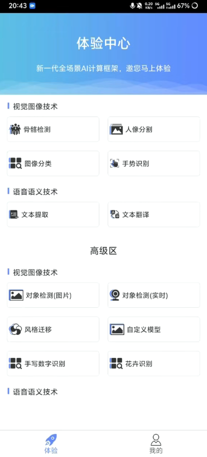
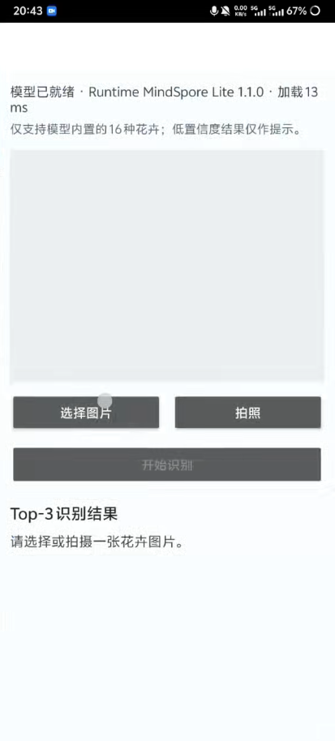
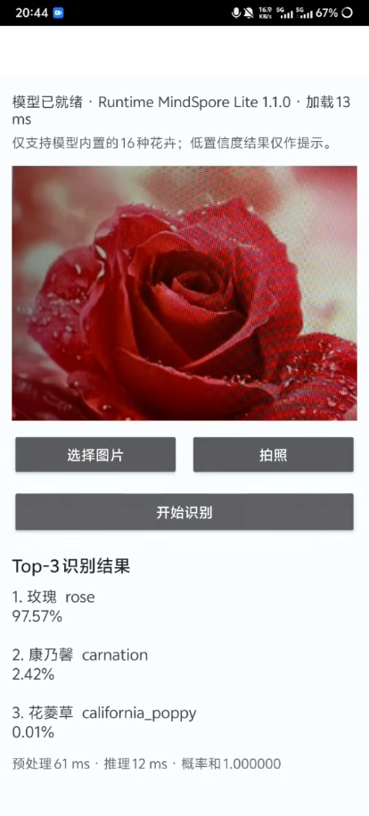

# MindSpore AI 体验中心

一款面向 Android 端的 AI 能力体验应用，集成图像分类、目标检测、人像分割、骨骼检测、手势识别、文字识别、风格迁移等功能，并支持将计算机端训练得到的模型部署到手机端进行本地推理。

本项目新增了基于 **MindSpore Lite + MobileNetV2** 的花卉识别功能，可在手机本地完成 16 类常见花卉的分类，无需将图片上传到服务器。

---

## 功能介绍

### 基础功能

* 骨骼检测
* 人像分割
* 图像分类
* 手势识别
* 文本提取
* 文本翻译

### 高级功能

* 图片目标检测
* 实时目标检测
* 图像风格迁移
* 自定义模型推理
* 手写数字识别
* 花卉图像识别

---

## 花卉识别

花卉识别模块使用经过训练并转换为 MindSpore Lite 格式的 MobileNetV2 模型，在 Android 设备上完成端侧推理。

用户可以从相册选择花卉图片，应用完成图像预处理、模型推理和结果排序后，显示概率最高的花卉类别及 Top-3 预测结果。

### 支持类别

| 索引 | 英文名称             | 中文名称  |
| -: | ---------------- | ----- |
|  0 | astilbe          | 落新妇   |
|  1 | bellflower       | 风铃草   |
|  2 | black_eyed_susan | 黑心金光菊 |
|  3 | calendula        | 金盏花   |
|  4 | california_poppy | 花菱草   |
|  5 | carnation        | 康乃馨   |
|  6 | common_daisy     | 雏菊    |
|  7 | coreopsis        | 金鸡菊   |
|  8 | daffodil         | 水仙    |
|  9 | dandelion        | 蒲公英   |
| 10 | iris             | 鸢尾    |
| 11 | magnolia         | 木兰    |
| 12 | rose             | 玫瑰    |
| 13 | sunflower        | 向日葵   |
| 14 | tulip            | 郁金香   |
| 15 | water_lily       | 睡莲    |

### 模型参数

| 参数   | 配置                   |
| ---- | -------------------- |
| 模型结构 | MobileNetV2          |
| 模型格式 | MindSpore Lite `.ms` |
| 模型精度 | FP32                 |
| 模型大小 | 约 8.56 MiB           |
| 参数量  | 约 2.23M              |
| 输入形状 | `[1, 224, 224, 3]`   |
| 输入布局 | NHWC                 |
| 输入通道 | RGB                  |
| 输出形状 | `[1, 16]`            |
| 输出形式 | Softmax 分类概率         |
| 推理位置 | Android 端本地推理        |

### 图像预处理

模型推理前依次执行：

1. 根据图片 EXIF 信息修正方向；
2. 从图像中心裁剪正方形区域；
3. 缩放到 `224 × 224`；
4. 按 RGB 顺序读取像素；
5. 使用 ImageNet 均值和标准差进行归一化；
6. 转换为 NHWC 格式的 Float32 Tensor。

归一化公式如下：

```text
R = (R / 255.0 - 0.485) / 0.229
G = (G / 255.0 - 0.456) / 0.224
B = (B / 255.0 - 0.406) / 0.225
```

### 推理流程

```text
选择花卉图片
      ↓
方向修正与中心裁剪
      ↓
缩放至 224 × 224
      ↓
RGB 标准化
      ↓
MindSpore Lite 本地推理
      ↓
读取 16 维概率
      ↓
输出 Top-3 识别结果
```

### 可靠性判断

由于模型只包含 16 个已知类别，不具备真正的开放集识别能力，因此加入了低置信度提示机制。

当最高预测概率较低，或者第一名与第二名概率过于接近时，应用会提示用户重新拍摄，避免直接给出可信度不足的识别结果。

---

## 项目特点

### 端侧离线推理

花卉图片直接在手机本地完成处理，不需要上传至远程服务器，具有更低的网络依赖和更好的隐私性。

### 轻量化模型

采用 MobileNetV2 作为分类网络，在保证识别能力的同时控制模型大小和端侧计算量，适合移动设备部署。

### 完整模型生命周期

模型仅在页面初始化或首次使用时加载，并在后续推理中复用，避免每次点击识别都重复加载模型。

### 异步推理

模型加载和推理过程在后台线程执行，避免阻塞 Android UI 主线程。

### 可解释结果

应用不仅显示最终识别类别，还展示 Top-3 预测结果、置信度以及推理耗时。

---

## 应用截图

> 请将实际截图放入 `docs/images/` 目录，并根据文件名称修改下面的路径。

### 应用主页

<p align="center">
  
</p>

### 花卉识别页面

<p align="center">
  
</p>

### 识别结果

<p align="center">
  
</p>

---

## 技术栈

* Android 原生开发
* MindSpore Lite
* MobileNetV2
* Android Bitmap / ByteBuffer
* Gradle
* 部分通用 AI 功能基于 HMS ML Kit

---

## 项目结构

实际目录可能根据工程模块划分有所不同，核心文件结构如下：

```text
project
├── app
│   └── src
│       └── main
│           ├── assets
│           │   └── train.ms
│           ├── java
│           │   └── ...
│           │       └── flower
│           │           ├── FlowerRecognitionActivity
│           │           ├── FlowerModelExecutor
│           │           ├── FlowerLabel
│           │           └── FlowerResult
│           ├── res
│           │   ├── layout
│           │   ├── drawable
│           │   └── values
│           └── AndroidManifest.xml
├── docs
│   └── images
├── build.gradle
├── settings.gradle
└── README.md
```

---

## 环境要求

* Android Studio
* JDK 8 或更高版本
* Android SDK：以项目 `build.gradle` 配置为准
* 支持 ARM64 的 Android 真机
* Gradle：以工程 Wrapper 配置为准

建议使用真机测试模型推理功能。

---

## 运行方法

### 1. 克隆项目

```bash
git clone <你的仓库地址>
cd <项目目录>
```

### 2. 检查模型文件

确认模型存在于项目配置的 assets 目录中，例如：

```text
app/src/main/assets/train.ms
```

模型文件应保持原始 `.ms` 格式，不要重命名为压缩文件。

### 3. 检查 Gradle 配置

需要确保 APK 构建时不会压缩 `.ms` 模型：

```gradle
androidResources {
    noCompress 'ms'
}
```

部分旧版 Android Gradle Plugin 可以使用：

```gradle
aaptOptions {
    noCompress "ms"
}
```

只需根据当前项目版本保留其中一种配置。

### 4. 编译并运行

1. 使用 Android Studio 打开项目；
2. 等待 Gradle Sync 完成；
3. 连接已开启 USB 调试的 Android 真机；
4. 点击 Run；
5. 在应用主页进入“花卉识别”；
6. 选择图片并开始识别。

---

## 注意事项

* 模型仅支持当前列出的 16 类花卉；
* 输入其他物体时，模型仍可能强制预测为某一花卉类别；
* 建议选择主体清晰、光线充足、花朵占比较大的图片；
* 模型识别结果仅作为 AI 技术演示，不应作为植物学专业鉴定依据；
* 不同手机的 CPU 性能不同，推理耗时可能存在差异；
* `.ms` 模型格式与 MindSpore Lite Runtime 版本需要保持兼容。

---

## 模型来源

花卉分类模型及类别定义参考：

* [Huawei Codelabs — HiPlants](https://github.com/huaweicodelabs/multi-kit-codelabs/tree/main/hiplants)
* [MindSpore](https://github.com/mindspore-ai/mindspore)

本项目没有接入原 HiPlants 示例中的 Search Kit、OAuth 或网络搜索逻辑，仅使用其花卉分类模型及类别定义，并根据当前 Android 工程重新实现端侧推理流程。

---

## 后续计划

* [ ] 支持相机实时花卉识别
* [ ] 增加更多花卉类别
* [ ] 加入非花卉图片拒识能力
* [ ] 对模型进行 FP16 或 INT8 量化
* [ ] 增加花卉简介和养护建议
* [ ] 增加识别历史记录
* [ ] 测试不同 Android 设备的推理性能
* [ ] 增加模型准确率和混淆矩阵评估

---

## 致谢

感谢 MindSpore、Huawei Codelabs 和相关开源项目提供的模型部署示例与技术支持。

本项目主要用于移动端人工智能、模型轻量化和端侧推理技术的学习与实践。
